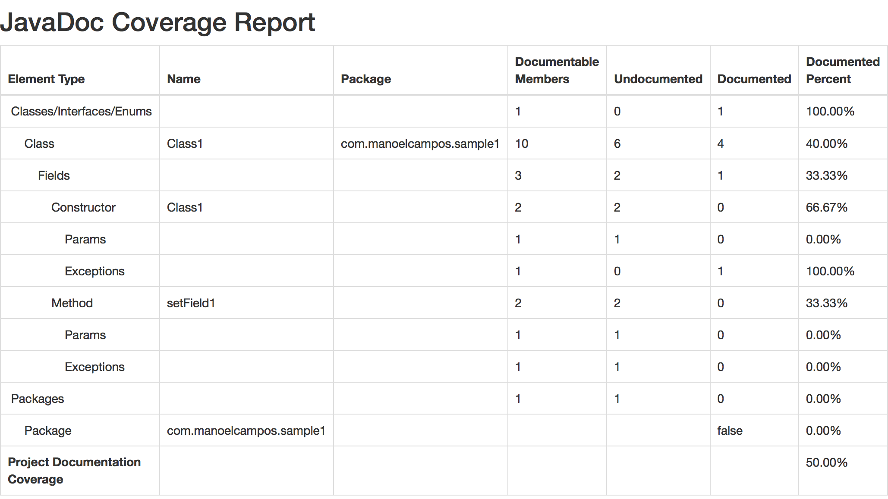

# JavaDoc Coverage Doclet 
[](https://github.com/manoelcampos/javadoc-coverage/actions/workflows/maven.yml) [](https://www.codacy.com/app/manoelcampos/javadoc-coverage?utm_source=github.com&amp;utm_medium=referral&amp;utm_content=manoelcampos/javadoc-coverage&amp;utm_campaign=Badge_Grade) [](https://maven-badges.herokuapp.com/maven-central/com.manoelcampos/javadoc-coverage) [](http://www.gnu.org/licenses/gpl-3.0)



The Doclet parses java source files and checks the percentage of the Java code covered by JavaDoc documentation, including:
- packages (*Java 9 modules not supported yet*)
- classes, inner classes, interfaces and enums
- class attributes
- methods, parameters, exceptions and return value.

A sample coverage report is available [here](https://manoelcampos.com/javadoc-coverage/sample-project/target/site/apidocs/javadoc-coverage.html).

Current IDEs warn about missing JavaDoc tags and documentation, allowing you to individually fix the issues, but you don't get a big the picture. 
Similar to code coverage tools, this plugin provides a way to get a summarized overview of your project's documentation coverage.
It provides a [Doclet](http://docs.oracle.com/javase/7/docs/technotes/guides/javadoc/doclet/overview.html) to be used with the JavaDoc Tool to show JavaDoc documentation coverage of your project.

# Usage

The easier ways to use the plugin is through Maven or Gradle. You can use the plugin calling the JavaDoc Tool directly from the command line (but this isn't handy and it isn't explained here).

## Maven: Using the CoverageDoclet in a regular way

To generate the regular JavaDoc HTML files and the coverage report, you have to include two `<execution>` tags for the `maven-javadoc-plugin` inside your project's `pom.xml` file, as the exemple below:

```xml
<build>
    <plugins>
        <plugin>
            <groupId>org.apache.maven.plugins</groupId>
            <artifactId>maven-javadoc-plugin</artifactId>
            <version>2.10.4</version>
            <executions>
                <!-- Exports JavaDocs to regular HTML files -->
                <execution>
                    <id>javadoc-html</id>
                    <phase>package</phase>
                    <goals>
                        <goal>javadoc</goal>
                    </goals>
                </execution>

                <!-- Generates the JavaDoc coverage report -->
                <execution>
                    <id>javadoc-coverage</id>
                    <phase>package</phase>
                    <goals>
                        <goal>javadoc</goal>
                    </goals>
                    <configuration>
                        <doclet>com.manoelcampos.javadoc.coverage.CoverageDoclet</doclet>
                        <docletArtifact>
                            <groupId>com.manoelcampos</groupId>
                            <artifactId>javadoc-coverage</artifactId>
                            <version>1.1.0</version>
                        </docletArtifact>
                    </configuration>
                </execution>
            </executions>
        </plugin>
    <plugins>
<build>
```

Now, to generate the regular JavaDocs in HTML and the documentation coverage report, you can execute the `package` goal in Maven, using your IDE or the command line inside your project's root directory:

```bash
mvn clean package
```

The JavaDoc coverage report is generated by default as `javadoc-coverage.html` at `target/site/apidocs/`.

There is a [sample project](sample-project) where you can test the plugin. Just execute the command above inside the project's directory to see the results.

## Maven: Using the CoverageDoclet with the maven-site-plugin
If you are generating a maven site and want to include the regular JavaDocs HTML and the JavaDoc Coverage Report into the "Reports" section of the site, the `maven-javadoc-plugin` must be included with slightly different configurations into the `<reporting>` tag (instead of the `<build>` tag), as the example below:

```xml
<reporting>
    <plugins>
        <plugin>
            <groupId>org.apache.maven.plugins</groupId>
            <artifactId>maven-javadoc-plugin</artifactId>
            <version>2.10.4</version>
            <reportSets>
                <reportSet>
                    <!-- Exports JavaDocs to regular HTML files -->
                    <id>javadoc-html</id>
                    <reports>
                        <report>javadoc</report>
                    </reports>
                </reportSet>

                <reportSet>
                    <!-- Generates the JavaDoc coverage report -->
                    <id>javadoc-coverage</id>
                    <reports>
                        <report>javadoc</report>
                    </reports>
                    <configuration>
                        <name>JavaDoc Coverage</name>
                        <description>Percentage of the code coverage by JavaDoc documentation.</description>
                        <doclet>com.manoelcampos.javadoc.coverage.CoverageDoclet</doclet>
                        <docletArtifact>
                            <groupId>com.manoelcampos</groupId>
                            <artifactId>javadoc-coverage</artifactId>
                            <version>1.1.0</version>
                        </docletArtifact>
                        <!-- This is the same as using -d into the additionalparam tag -->
                        <destDir>javadoc-coverage</destDir>
                        <!-- You can also use -o instead of -outputName to define
                        the name of the generated report. -->
                        <additionalparam>-outputName "index.html"</additionalparam>
                    </configuration>
                </reportSet>
            </reportSets>
        </plugin>
    </plugins>
</reporting>
```

Notice that in this case, the coverage report is being generated into the `target/site/javadoc-coverage` (as defined by the `destDir` tag) with the name of `index.html` (as defined by the `<additionalparam>` tag), as required for the maven site. More details of additional parameters is provided in the next section.

Now, to generate the site you can execute:

```bash
mvn clean site
```

The list of project's reports will be included into the `target/site/project-reports.html` file.

## Gradle

To use the Doclet with Gradle, add the following code to your `build.gradle` file.

```gradle
configurations {
// Other configuration lines might be in here
    javadocCoverage
}
dependencies {
// Your application's other dependencies go here.
    javadocCoverage "com.manoelcampos:javadoc-coverage:1.1.0"
}
// This generates the Javadoc coverage report into build/reports/javadoc/javadoc-coverage.html
task javadocCoverageReport(type: Javadoc, dependsOn: javadoc) {
    source = sourceSets.main.allJava
    destinationDir = reporting.file("javadoc")
    options.docletpath = configurations.javadocCoverage.files.asType(List)
    options.doclet = "com.manoelcampos.javadoc.coverage.CoverageDoclet"
}
// Optionally you can add the dependsOn here so that when you generate the javadoc
// jar, e.g. if you include the javadocJar in a publishing configuration, the javadoc
// coverage report will be generated automatically.
task javadocJar(type: Jar, dependsOn: javadocCoverageReport) {
    classifier "javadoc"
    from javadoc.destinationDir
}
```

# Additional Configuration (optional)

You can define additional configurations for the plugin. 
The examples below are presented only for Maven (but the same parameters work for Gradle).

## Changing the name of the coverage report file
The CoverageDoclet accepts the command line parameter `-outputName` (`-o` for short) to set the name of the report. The following example shows the code to be added to the `<configuration>` tag of the `maven-javadoc-plugin`:
```xml
<additionalparam>-outputName "my-project-javadoc-coverage-report.html"</additionalparam>
```

## Excluding packages from the coverage report
You can exclude some packages from the coverage report by adding the code example below into the `<configuration>` tag of the `maven-javadoc-plugin`.

```xml
<configuration>
    <doclet>com.manoelcampos.javadoc.coverage.CoverageDoclet</doclet>
    <docletArtifact>
        <groupId>com.manoelcampos</groupId>
        <artifactId>javadoc-coverage</artifactId>
        <version>1.1.0</version>
    </docletArtifact>
    <!-- Excludes packages from the coverage report. -->
    <excludePackageNames>com.manoelcampos.sample2</excludePackageNames>
</configuration>
```

The example shows how to ignore the package `com.manoelcampos.sample2` from the coverage report. The `<excludePackageNames>` tag accepts a list of packages separated by `:` and also wildcards such as `*`.
For more details, check this [link](https://maven.apache.org/plugins/maven-javadoc-plugin/examples/exclude-package-names.html).

If you are generating the regular JavaDoc HTML files, you have to include this configuration only where the CoverageDoclet is being used into your pom.xml, unless you want these packages to be excluded from the regular JavaDocs too.

# Building the Doclet from Sources

The Doclet is a Java Maven project which can be built directly from any IDE or using the following maven command:

```bash
mvn clean install
```

The command builds the Doclet and install it at your local maven repository.

